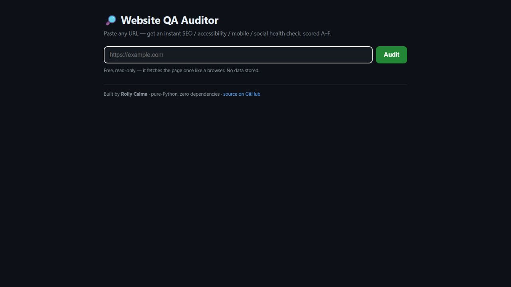

# Website QA Auditor

A **zero-dependency** Python CLI that audits any web page for common **SEO, accessibility,
mobile, and social-share** problems, scores it, and writes a client-ready Markdown report.
Pure standard library — no `pip install` required.



## Portfolio proof
- [Case study](PORTFOLIO-CASE-STUDY.md) — how this becomes a sellable website QA/deployment audit.
- GitHub Actions smoke check compiles the CLI, runs the sample audit, and confirms a Markdown report is produced.

## What it checks
- **SEO:** `<title>` presence + length, meta description, heading structure (one `<h1>`)
- **Accessibility:** image `alt` text, `<html lang>`, mobile `<meta viewport>`
- **Social share:** Open Graph tags (`og:title/description/image`) so links preview properly
- **Hygiene:** empty/placeholder links, mixed `http://` content, favicon, page weight

Each finding is a **real, fixable issue** with a plain-English reason — and the tool exits non-zero
if anything fails (handy for CI).

## Usage
```bash
python auditor.py https://example.com                 # audit a live URL
python auditor.py --file sample.html                  # audit a local file
python auditor.py https://example.com --out report.md # write a Markdown report
python auditor.py https://example.com --links         # also HEAD-check links for 404s
python auditor.py https://example.com --ai            # add an AI client summary (needs ANTHROPIC_API_KEY)
```

## Example output
```
============================================================
  Website QA Audit — sample.html
  Score: 50%  (grade F)
============================================================
  [WARN] Page title: 5 chars (aim 20–65): 'Joe's'
  [FAIL] Meta description: Missing — hurts search snippets + click-through.
  [PASS] Mobile viewport: Present.
  [FAIL] Image alt text: 2/3 images missing alt text.
  ...
  2 fail, 7 warn, 2 pass
```
See `sample.html` + `sample-report.md` for a full example.

## How it works
- Parses HTML with the standard-library `html.parser` (no BeautifulSoup needed)
- Collects title/meta/headings/images/links, runs a rule set, and grades A–F
- Optional `--ai` mode calls the Anthropic API (via `urllib`, no SDK) to write a friendly
  client summary + top-3 fixes — gracefully skipped if no key is set

## Why it exists
A fast, honest health check for the websites I build and audit — and a single-file Python tool
anyone can run with zero setup.

## License
MIT © Rolly Calma ([Ghraven](https://github.com/Ghraven))

---
_By **Rolly Calma** — see live demos & services at **[rollycalma.com](https://rollycalma.com/)**._
